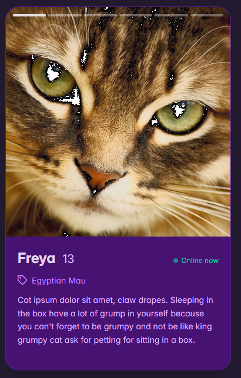
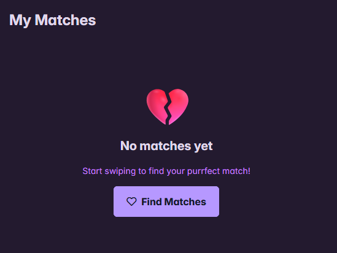

## Meow & Mingle

A dating app for cats to find your purrfect match

## Screenshots

## Tech Stack

### API

- Rust
- Axum
- Postgres
- Docker

### Front end

- React
- [Zustand](https://zustand.site/en/) for state management
- [PrimeReact](https://primereact.org/) for UI components and theming
- Code generation using [utoipea](https://github.com/heyapi/utoipea) and [heyapi](https://github.com/heyapi/heyapi)

## Run the app

- Postgres: `docker compose up -d`
- API: `task api`
- Front end: `task fe`

## Run tests

`cargo nextest run`

## Run test coverage report

`cargo llvm-cov nextest`

## Run password hashing utility

`cargo run --bin hash_password -- "yourpassword"`
